## Skeleton-based Gait Recognition via Robust Frame-level Matching (RFM)
#### This paper is accepted to IEEE Transactions on Information Forensics and Security [TIFS 2019]
#### Impact factor: 6.211
#### [Go to project page!](https://sites.google.com/site/seokeonchoi/gait-recognition)
#### [Paper!](https://drive.google.com/file/d/1ey72F8vQQjftLbRucDG-GtXeJneM-Yyv/view?usp=sharing)

---
 

### Abstract

Gait is a useful biometric feature for human identification in video surveillance applications since it can be obtained without subject cooperation. In recent years, model-based gait recognition using a 3D skeleton has been widely studied through view-invariant modeling and kinematic gait analysis. However, existing methods integrate all frame-level feature vectors using the same criterion, even though skeleton information is highly sensitive to changes in covariate conditions such as clothing, carrying, and occlusion. The scheme inevitably reduces the frame-level discriminative power and eventually degrades performance. Instead, we propose a robust frame-level matching method for gait recognition that minimizes the influence of noisy patterns as well as secures the frame-level discriminative power. To this end, we measure the skeleton quality in terms of body symmetry for each frame. Based on the quality, we construct a quality-adjusted cost matrix between input frames and registered frames to prevent matching with noisy patterns. Our two-stage linear matching is then applied to the cost matrix to compute a frame-level discriminative score including similarity and margin. In the end, the identity of a probe is determined by a weighted majority voting scheme via frame-level scores. It enhances the robustness against inaccurate skeleton estimation results by assigning different weights for each frame based on the score. Our approach outperforms the state-of-the-art methods on three public datasets (UPCVgait, UPCVgaitK2, and SDUgait) and a new gait dataset which we create with consideration of unpredictable behaviors while walking. In addition, we demonstrate that our method is robust to skeleton estimation error, partial occlusion, and data loss. The CILgait dataset and MATLAB code are available at https://sites.google.com/site/seokeonchoi/gait-recognition.

---

### Overall framework

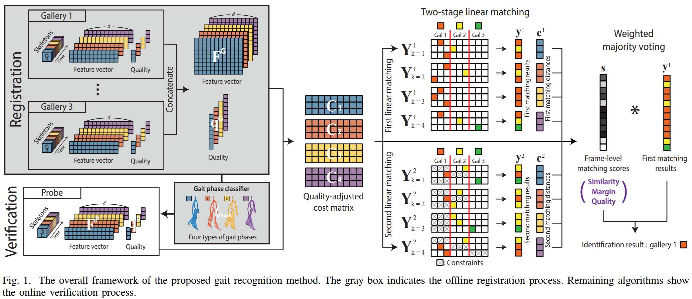

---

### Usage 

(1) Download the dataset, and modify each format and path. (function : NodeComposition)
- (Datasets for gait recognition are not provided directly in the code by privacy)
- UPCV1 & UPCV2 : http://www.upcv.upatras.gr/personal/kastaniotis/datasets.html
- SDUgait : https://sites.google.com/site/sdugait/
- CILgait : https://sites.google.com/site/seokeonchoi/gait-recognition

- For example:UPCV1)
  -> Download "UPCV_gait_r1.zip"
  -> Move "UPCVgait.mat" file (in the /UPCV_gait_r1/upcvgaitV1/MatlabFormat/) to "/PATHTO/DB/UPCV1/"
  -> Change the file name "UPCVgait.mat" to "data.mat"

(2) Run main.m

(3) Set parameters (function : SetParametersManual)
- If you want to do various experiments as in the manuscript, carefully confirm the below functions. 
(SetFlagGen, SetParameters, SetSituations, SetMethods, SetNames)
- But these functions are very complicated... (so many experiments)
- We recommend that you manually change the parameters and check for changes in performance.

##### If you have any questions, please contact us through email (seokeon@kaist.ac.kr). 

---

### Version  

- Ver.1 is released (2018.11.29) : First edition (in Major revision)
- Ver.2 is released (2019.02.04) : Various methods and experiments in the manuscript are included. (in Minor revision)
- Ver.2 is released (2019.02.26) : Final version (the paper is accepted and uploaded)

---

### Acknowledgments 

We are so grateful to these authors.

#### Dataset 
  
(1) UPCV1 
- D. Kastaniotis, I. Theodorakopoulos, C. Theoharatos, G. Economou, and S. Fotopoulos, "A framework for gait-based recognition using kinect," Pattern Recognit. Lett., vol. 68, pp. 327?335, 2015.

- D. Kastaniotis, I. Theodorakopoulos, G. Economou, and S. Fotopoulos, "Gait-based gender recognition using pose information for real time applications," in Proc. IEEE Int. Conf. Digit. Signal Process., 2013, pp. 1?6.

(2) UPCV2 
- D. Kastaniotis, I. Theodorakopoulos, G. Economou, and S. Fotopoulos, "Gait based recognition via fusing information from euclidean and riemannian manifolds," Pattern Recognit. Lett., vol. 84, pp. 245?251, 2016.

(3) SDUgait 
- Y. Wang, J. Sun, J. Li, and D. Zhao, "Gait recognition based on 3d skeleton joints captured by kinect," in Proc. IEEE Int. Conf. Image Process., 2016, pp. 3151?3155.
- J. Sun, Y.Wang, J. Li,W.Wan, D. Cheng, and H. Zhang, "View-invariant gait recognition based on kinect skeleton feature," Multimed. Tools Appl., pp. 1?27, 2018.

#### Comparison target
  
(1) D. Kastaniotis, I. Theodorakopoulos, C. Theoharatos, G. Economou, and S. Fotopoulos, "A framework for gait-based recognition using kinect," Pattern Recognit. Lett., vol. 68, pp. 327?335, 2015.

(2) F. Ahmed, P. P. Paul, and M. L. Gavrilova, "Dtw-based kernel and rank-level fusion for 3d gait recognition using kinect," Vis. Comput., vol. 31, no. 6-8, pp. 915?924, 2015.

(3) J. Preis, M. Kessel, M. Werner, and C. Linnhoff-Popien, "Gait recognition with kinect," in Proc. Int. Workshop Kinect Pervasive Comput., 2012, pp. P1?P4.

(4) D. Kastaniotis, I. Theodorakopoulos, G. Economou, and S. Fotopoulos, "Gait-based gender recognition using pose information for real time applications," in Proc. IEEE Int. Conf. Digit. Signal Process., 2013, pp. 1?6.

(5) A. Ball, D. Rye, F. Ramos, and M. Velonaki, "Unsupervised clustering of people from 'skeleton' data," in Proc. ACM/IEEE Int. Conf. Human-Robot Interact., 2012, pp. 225?226.

---

### Experimental results

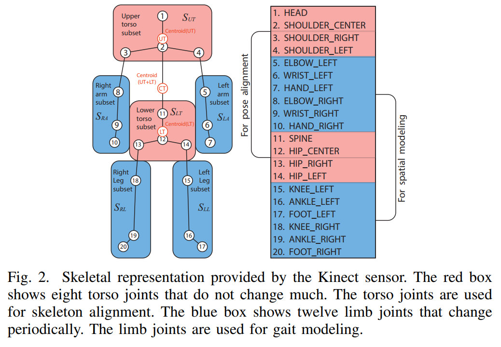
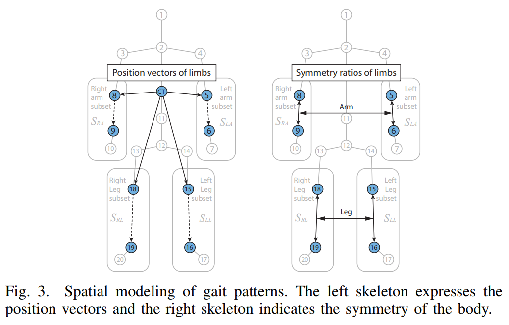
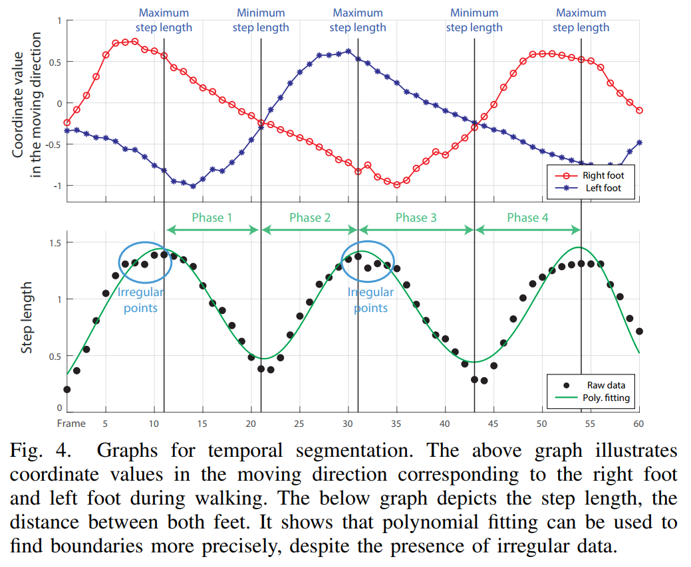
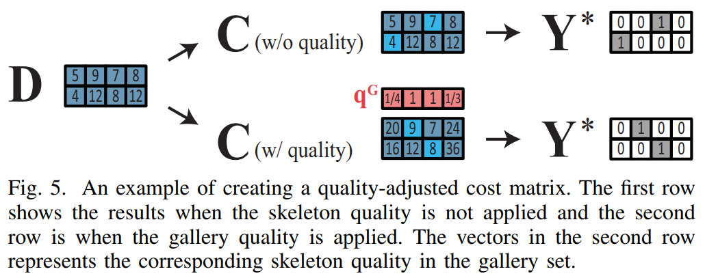
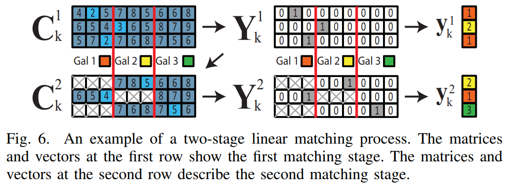
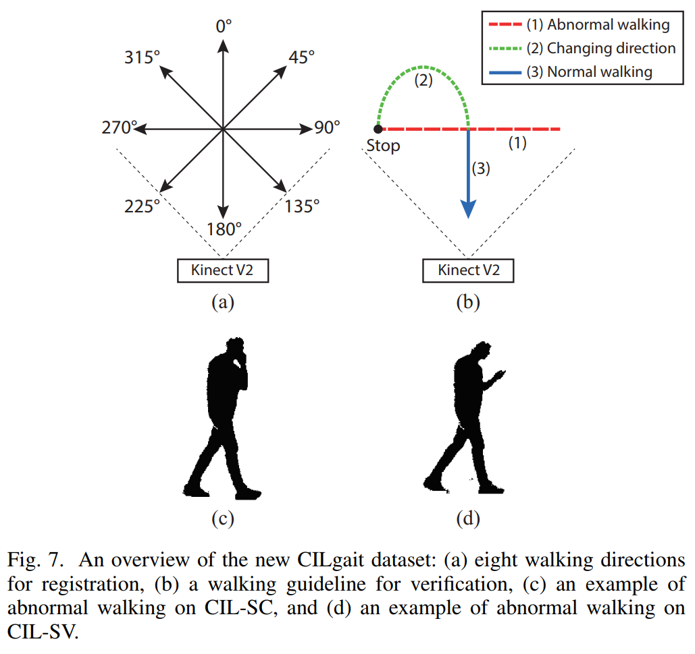
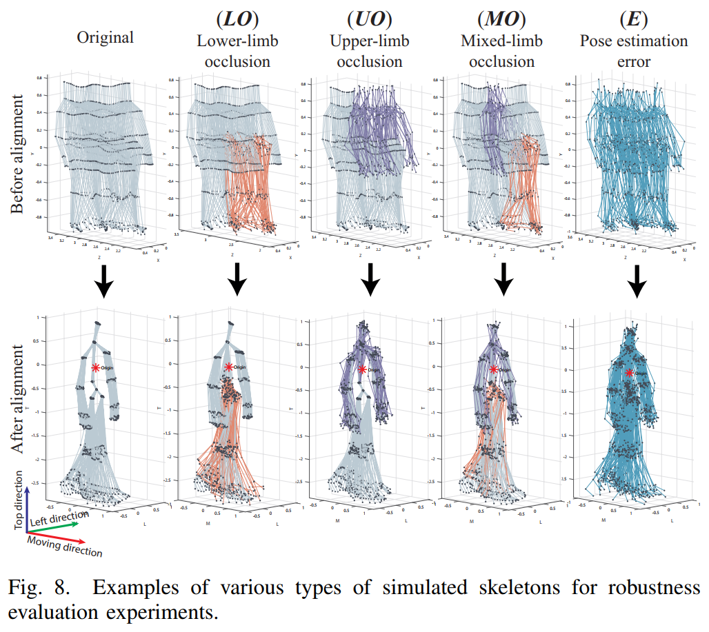
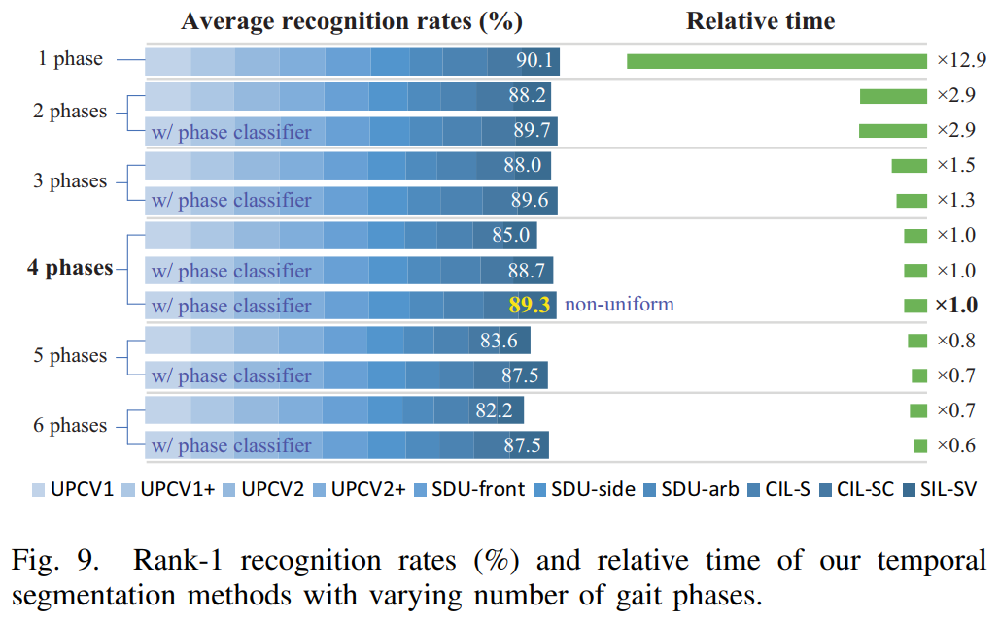
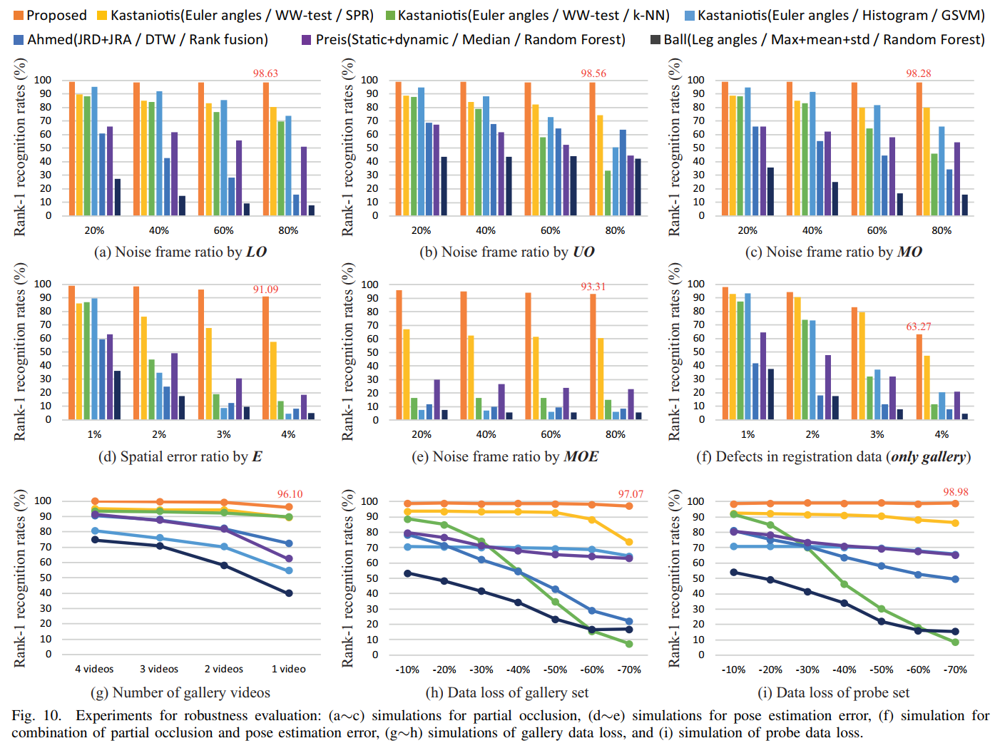
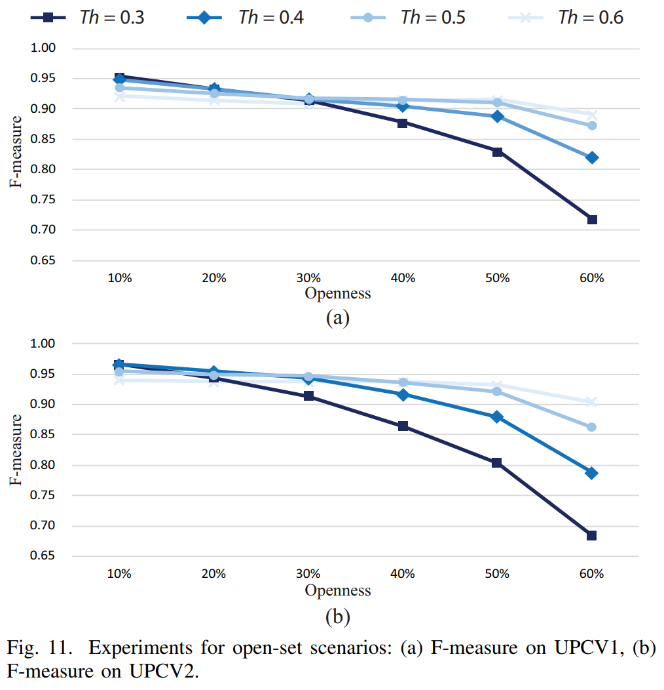
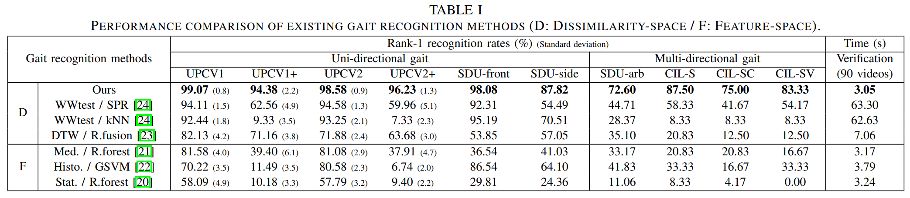
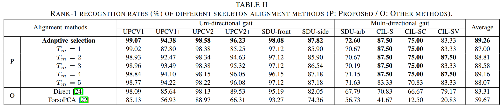
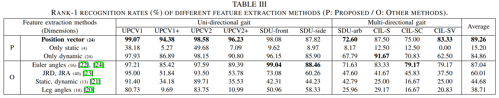
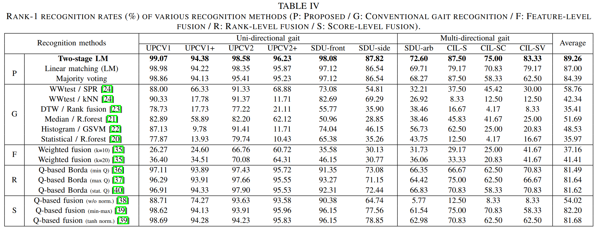
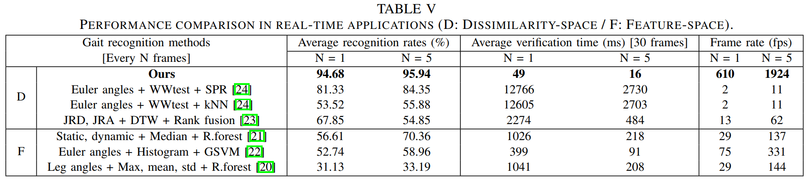

